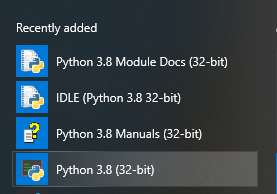

# Python Installatie

Python is opensource en is beschikbaar voor Windows, MacOS en Linux. Daarnaast
draait Python ook op de Raspberry PI. Het is gratis te downloaden van
[www.python.org/downloads](http://www.python.org/downloads)

Kies de juiste versie en download de laatste release van Python. (op het moment
van schrijven is dat 3.8.4).  
**Note:** versie 3 Python is niet compatibel met versie 2. Als je op het
internet Python code vindt, moet je goed opletten in welke versie het is
geschreven. Python 2 source code werkt niet in de Python 3 omgeving.

De Python omgeving is geschreven in “C”.  
**Vraag:** Waarom denk je dat dit zo is? (Uit de introductie readme kun je
afleiden waarom.)

Wanneer je het installatieprogramma hebt gedownload, start je het en je klikt
dan aan:

-   Install launcher for all Users

-   Add Python to Path

Daarna kies je een eigen directory waar je Python installeert. Iets als:
C:/Python. (of een ander voor de hand liggende plaats zoals D:/program
files/Python. De keuze is helemaal aan jou.

Om te controleren of alles goed is gegaan, ga je (in Windows) eerst eens naar de
opdrachtprompt (command prompt, cmd) Dan open zich een console-achtig venster op
de desktop.  
Daar typ je: Python –version

Is alles goed gegaan, dan zie je op de volgende regel het versienummer van de
Python installatie.  
In het startmenu van Windows 10 zie je dit:

Hier staan manuals, overige docmentatie, de Python interpreter en de Python
shell: IDLE.  
Het lijkt er op alsof de installatie is gelukt.  
Daarmee is deze taak afgerond.
