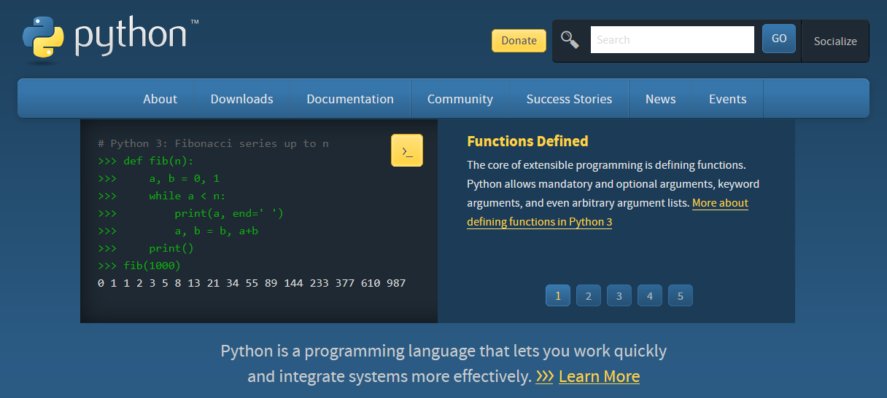
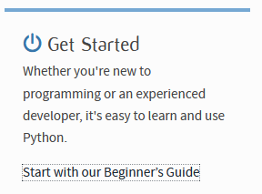

# Python-BASIC-Taak01

## Python installatie:

### Uitleg Algemeen

Python is opensource en is beschikbaar voor Windows, MacOS en Linux. Daarnaast
draait Python ook op de Raspberry PI. Het is gratis te downloaden van
[www.python.org/downloads](http://www.python.org/downloads)

Kies de juiste versie en download de laatste release van Python. (op het moment
van schrijven is dat 3.8.4).  
**Note:** versie 3 Python is niet compatibel met versie 2. Als je op het
internet Python code vindt, moet je goed opletten in welke versie het is
geschreven. Python 2 source code werkt niet in de Python 3 omgeving.

De Python omgeving is geschreven in “C”.  
**Vraag:** Waarom denk je dat dit zo is? (Uit de introductie readme kun je
afleiden waarom.)

### Installatie procedure

Voer de installatieprocedure uit.

Je gaat naar de website python.org:

Wanneer je het installatieprogramma hebt gedownload, start je het en je klikt
dan aan:

-   Install launcher for all Users

-   Add Python to Path

Daarna kies je een eigen directory waar je Python installeert. Iets als:
C:/Python. (of een ander voor de hand liggende plaats zoals D:/program
files/Python. De keuze is helemaal aan jou.

Om te controleren of alles goed is gegaan, ga je (in Windows) eerst eens naar de
opdrachtprompt (command prompt, cmd) Dan open zich een console-achtig venster op
de desktop.  
Daar typ je: Python –version

In de installatie heb je ook IDLE geïnstalleerd. Als je alle stappen goed hebt
doorlopen, vertelt windows 10 je het volgende:

Je kunt nu met IDLE aan de slag. IDLE is een eenvoudige ontwikkelomgeving.

Als je het opent, is er een window met een copyright mededeling op de eerste
paar regels en daaronder zie je de typische python prompt: \>\>\>  
Om te kijken of alles werkt typ je eens in : 6 \* 5 [enter]. Op de volgende
regels verschijnt het antwoord van dit sommetje (30). Python is actief. Het
sommetje wordt begrepen en uitgerekend.

**De installatie is gelukt.**

Het is goed om ook even te kijken naar de beginners guide om een beetje wegwijs
te worden in de omgeving. Ook vind je hier tips over installatie (mocht het toch
problemen opleveren), suggesties voor IDE’s en editors.

Hier ook links naar codevoorbeelden, boeken, naslag werken, etc.

Voor de integratie met VSCode heb je nodig: Python voor VSCode. (ook die is te
vinden in de beginners guide) Hier komen we later nog op terug. Eerst gaan we
aan de slag met de Python Shell: IDLE.

## Leerdoelen

[ ] Ik weet hoe ik Python moet installeren

[ ] Ik weet uit welke componenten de installatie bestaat.

[ ] Ik kan de standaard distributie van Python installeren

## Opdracht

De opdracht is om de standaard distributie zoals je die downloadt van Python.org
te installeren op jouw computer.

## Eindresultaat

Een werkende Python omgeving.

## Bronnen:

[www.python.org](www.python.org)
