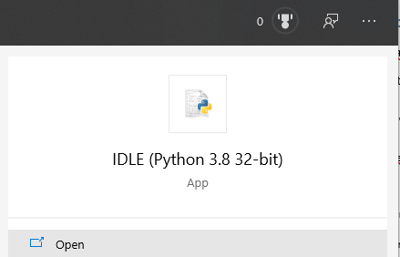
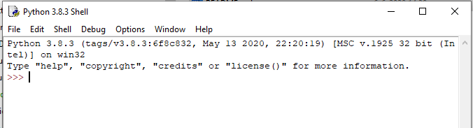

# PYTHON BASICS-TAAK-02

## Datatypes in Python

### Uitleg

Python is een beetje "los" met datatypes, maar ze bestaan natuurlijk wel. Zo heb
je o.a. integers, floats, strings. Dit zijn de standaard types. Maar Python kent
ook dict, list, set and tuples. Kijk maar eens bij:
(<https://docs.python.org/3/library/datatypes.html>)

We beginnen met de standaard datatypes.

### Int(eger) en Float(ing point)



Open IDLE (in Windows 10:)  
Startbalk :: typ IDLE in.

Als alles goed gaat, vindt Windows de volgende app:

(Alleen als alles goed geïnstalleerd is. Zie je dit niet, ga dan terug naar de
installatie en doe dat opnieuw.)

Open deze app. Er opent een nieuw window, zoals hieronder:



Kenmerkend is de prompt: “\>\>\>”.

Alles wat je hierachter typt, wordt door de interpreter geïnterpreteerd als een
statement. Eigenlijk typ je nu regels code in, regel voor regel. Die code wordt
vervolgens uitgevoerd door de Python interpreter. Aan de slag!

#### OEFENINGEN

## Leerdoelen

* Ik ken enkele datatypen van python.

* Ik kan die datatypen toepassen

* Ik weet van inmutable strings

## Opdrachten

**Hieronder vind je een aantal opdrachten en vragen. Voer de opdrachten uit en
beantwoordt de vragen.**

JE werkt in de Python shell (IDLE).

Typ na de prompt \>\>\> in: (elke regel sluit je af met Enter)

1 + 1

Python zal reageren met:

\>\>\>2

Vervolgens type je achtereenvolgens een paar sommetje. Bedenk maar je eigen
sommetjes. Dingen als:

\>\>\>24 / 6

\>\>\>25 / 2 + 3 en:

\>\>\>24 / (2 + 3)

En:

\>\>\>(100 -32) \* 5/9

Herken je deze laatste berekening? … Het is de omrekening van graden Fahrenheit
naar Celsius. Python behandelt zo’n regel als een stukje code en evalueert de
regel als een expressie. In een Python programma zou je schrijven:  
gradencelsius= (gradenfahrenheit – 32) \* 5/9.

Omgekeerd, van °C naar °F, is de formule: °F = °C \* 9/5 + 32.

**Opdracht**: Laat Python dat maar eens uitrekenen voor een temperatuur van 34
°C.

### Meer over Ints en Floats

Hoe kom je er achter welk datatype Python hanteert?

Door middel van een statement: type(). Tussen de haakje kan ook een expressie
staan.

>Voorbeeld: A = 10  
>In dit geval zal python er een "int" van maken omdat er geen fractie is.
>Gebruik type(A) om vast te stellen welk type variabele het is.  
>Voorbeeld: B = 10.0  
>In dit geval zal python er een "float" van maken omdat er een fractie is, al
>is de fractie 0 in dit voorbeeld.  
>Stel dit vast met: type(B)

Maar wat wordt nu het type van x in: x = (50 / 2) ? In dit sommetje worden
uitsluitend integers gebruikt en de uitkomst is ook een integer. Maar denkt
Python daar hetzelfde over? :: type(x) geeft het antwoord.

>Onthoudt: Bij een deling maakt Python van de uitkomst altijd een float.

De python interpreter kent zelf datatypes toe en doet dat meestal correct. Maar
een enkele keer kom je erdoor in de problemen. In dat geval moet je de
documentatie voor de taal raadplegen om te zien hoe het precies werkt. Je vindt
alle beschikbare informatie over python bij:
[hhtps://www.python.org](hhtps://www.python.org)

**Opdracht**: Maak tenminste 10 expressies waarin:

1. Meer dan één operator voorkomt (een operator is een rekenkundige bewerking
    zoals + - / \* of \*\*)

2. Meer dan één getal voorkomt.

3. Haakjes voorkomen.

Een goede expressie is dan bijvoorbeeld :: \>\>\>4 \* (233 – 12)  
Python geeft dan het resultaat :: 884

Lever een screenshot in van het IDLE window waarin je deze 10 sommetjes laat
zien.

**Opdracht**: Maak vervolgens gebruik van variabelen in dezelfde expressies.
Hiervoor moet je in de interpreter meerdere regels intypen, zoals, gebruik
makend van de expressie hierboven:

\>\>\>A = 4

\>\>\>B = 233

\>\>\>C = 12

\>\>\>Print( A \* (B – C))

Als alles goed ging is ook hier het antwoord: 884

Lever een screenshot in van het IDLE window waarin je deze 10 sommetjes laat
zien.

#### Advanced

>Iets ingewikkelder operators bestaan ook:
>Zoals: % en //  
>
>Bij % krijg je de rest (modulus) van een deling te zien, een voorbeeld:
>7 / 2 (7 gedeeld door 2) is 3.5 Dit betekent dat 7 = 3 \* 2 (=6) plus 0.5 \*
>2 (=1).
>En 6 + 1 is dan weer 7. 1 is de rest van de deling wanneer 7 door 2 gedeeld
>wordt.
>Dus 7 % 2 heeft als antwoord : 1 Dit wordt de Modulus genoemd.
>
>Bij de operator // wordt het resultaat van de deling naar beneden afgerond.  
>In hetzelfde voorbeeld: 7 / 2 = 3.5 en 7 // 2 = 3. Hier wordt 3.5 naar beneden afgerond naar 3.

#### Strings

>Strings zijn (grotendeels) wat je ervan verwacht.  
>Voorbeeld: C = "Python"  
>Je weet het al: Dit is een string.
>
>Maar ook hier heeft Python enkele eigenaardigheden. Strings zijn
>“inmutable”. = Wel te initiëren, maar niet te veranderen. Laten we eens zien
>hoe dat werkt.
>
>Maak een string. Maakt niet uit wat er in die string staat. Een voorbeeld:

\>\>\> dag = “maandag”

\>\>\> print(dag)

>En met print(dag) zie je wat Python hiervan maakt. Dat gaat helemaal goed.
>Vervolgens doe je:

\>\>\>dag = “maandag 24 augustus”

\>\>\>print(dag)

>Geheel volgens verwachting heeft python de oude string vervangen door de
>nieuwe.
>
>En als we twee string aan elkaar willen plakken gaat het ook zoals je
>verwacht.
>
>Maak eens twee strings. Vervolgens plak je ze aan elkaar en het resultaat en
>het resultaat sla je op in één van de strings.

```python  
a = “iets”

print(a)

b = “ anders”

print(b)

a = a + b

print(a)
```  

Dit werkt gewoon. Hoezo inmutable strings?

Dat zien we wanneer we wat dieper duiken in het gedrag van de strings. Tipje
van de sluier: de éne “a” is de andere niet … Python maakt achter de
schermen een nieuwe string a aan, zonder dat je er iets van merkt.

Waar gaat het dan wèl mis? Je weet nog van strings en arrays met indexes uit
PHP en javaScript. Dat kan ook in Python.

**Opdracht**: Typ in: een for loop waarin je één voor één de karakters in de
laatste string print. Je maakt hierbij gebruik van een index volgens de
syntax a[index]. Je zult de syntax van een for loop in Python moeten
opzoeken. Die is anders dan in javascript of PHP. (Zie onderaan bij
“bronnen” een goede link voor for loops.)

Het resultaat lijkt dan hierop. (Jij hebt misschien een andere string, maar
het werkt hetzelfde.)

```python
i

e

t

s

a

n

d

e

r

s
```  

Dat werkt. Maar als we nu a[0] (of een andere indexwaarde] willen veranderen
met:  
a[0] = “X” Wat gebeurt er dan? **Probeer**! … juist! Dat gaat niet. Je
krijgt een foutmelding.

Maar hoe zit het dan met a = a + b? Waarom lijkt dat dan wel te werken? Ga
eens op zoek naar het antwoord op deze vraag. Zoek op het internet naar:
“python inmutable strings”.

Stel dat je toch enkele karakters in een string wil aanpassen. Hoe doe je dat
dan?  
Je moet dan een nieuwe string maken met de veranderingen er in.

### Bronnen

Maak er een gewoonte van om de bron te raadplegen bij vragen over syntax. In dit
geval is dat: <https://docs.python.org/3/reference/index.html>

Alles over python: [hhtps://www.python.org](hhtps://www.python.org)  
Python datatypen: Python.org: <https://docs.python.org/3/library/datatypes.html>
Tutorials over python (Engelstalig) Python.org: <https://docs.python.org/3/tutorial/index.html>
For loops in python: <https://pythonforloops.com>  
Of:  
<https://www.w3schools.com/python/gloss_python_arithmetic_operators.asp>
