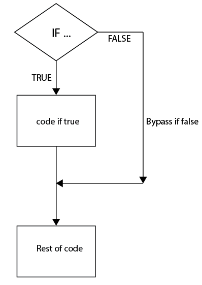
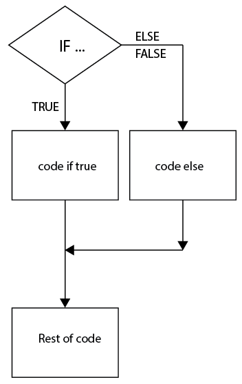

# PYTHON-BASIC-Taak01-If_en_else

## Hoe zit het met If, Else en Else-If in Python?

### Uitleg

De statements lijken heel erg op die in javaScript en PHP. Dat is natuurlijk
geen toeval. **Semantisch** gesproken doen ze ook precies hetzelfde. (= de
betekenis van deze key-woorden in Python is dezelfde als die in andere talen)

Je weet nog, een if statement kijkt of de expressie die erna komt TRUE of FALSE
is. (0 of 1) Een if statement heeft dan ook maar twee mogelijke uitkomsten. WAAR
of ONWAAR (TRUE of FALSE).

Hiermee is een if statement dus een boolean expression. In een flow chart
weergegeven, gebeurt er dit:

Het if statement staat hier bovenaan. De uitkomst van de expressie kan TRUE of
FALSE zijn. In het eerste geval (TRUE) wordt het blokje code onder de IF
uitgevoerd. De uitvoering volgt de pijl naar beneden.  
Is de uitkomst van de expressie echter FALSE, dan wordt dat stukje programma
overgeslagen.  
Daarna wordt de uitvoering van het programma weer hervat bij “Rest of code”

Er zijn geen restricties aan hoe kort of lang dat blokje “code if true” mag
zijn.

Maar … stel nu dat je het één wil doen als de IF TRUE is en het ander als de
uitkomst FALSE is.

In dat geval gebruik je ELSE. Dan wordt de code uitgevoerd die in de rechtertak
(branch) staat.

Dus: als de IF TRUE is, dan werkt de code net als in het eerste diagram. Maar
als de IF FALSE is, wordt de ELSE branch uitgevoerd.

Na de uitvoering van één van beide paden, wordt de uitvoering van de code weer
uitgevoerd in “Rest of code”.

Er zijn geen restricties aan de lengte van de code in de ELSE branch.

De **syntax** (= hoe je het precies opschrijft) is in Python een beetje anders.

Hoe ziet dit er uit in code?

Een stukje code met alleen een IF statement. We initialiseren a met de waarde 5
op de eerste regel.

a = 5

If (a = = 5):

Print(“a is gelijk aan 5”)

Print(“En nu zijn we er weer klaar mee”)

**Opdracht**:

- Schrijf nu een stukje code waarin je een ELSE opneemt. Deze code wordt
    uitgevoerd wanneer a niet gelijk aan 5 is. Maak hier dan een print statement
    waarin je laat printen dat a niet gelijk is aan 5.

- Teken hiervoor ook de flowchart.

We maken de situatie iets ingewikkelder.

Stel je voor dat je:

- Wil testen of a gelijk is aan 0.

- Wil printen of dat wèl of niet het geval is.

- En dan wil testen of a misschien dan gelijk is aan 1. En die situatie wil
    printen. (Voor deze situatie test je ook met de initialisatie van a = 1.)

- En dan wil testen of a misschien dan gelijk is aan 2. En die situatie wil
    printen. (Voor deze situatie test je ook met de initialisatie van a = 2.)

- En dan wil testen of a misschien dan gelijk is aan 3. En die situatie wil
    printen. (Voor deze situatie test je ook met de initialisatie van a = 3.)

- En dan wil testen of a geen van deze waarden heeft. En die situatie wil
    printen. (Voor deze situatie test je met de initialisatie van a = 4.)

Hiervoor kun je twee methoden gebruiken.

1 Je kunt natuurlijk meerdere If statements onder elkaar gebruiken.

2 Je kunt gebruik maken van het Python equivalent van elseif. Dat is elif

(In andere programmeertalen heb je ook nog een switch – case constructie. Maar
die bestaat niet in Python.)

Er is een belangrijk verschil tussen het gebruik van (a) meerdere if-statements
of (b) het gebruik van elif.

!- (media/5f70dd6319a78f399bb01157eeb22971.png)

Een flow diagram voor (b) maakt dat duidelijk:

Wat valt hier op?

Het minimum aantal conditions wordt uitgevoerd. Als er een TRUE wordt gevonden
gaat het programma eerst naar het bijbehorende code blokje en dan meteen verder
met het vervolg van het programma.

Na een TRUE worden er dus geen andere condities meer getest.

**Vraag**: Werkt dat ook zo met meerdere IF statements?

**Opdracht**: Teken een flowdiagram van het programma waarbij in plaats van
elif, if statements worden gebruikt.  
Ook in dat programma worden 4 condities gebruikt. Net als in het diagram
hiernaast.

**Opdracht**: Schrijf code die:

- Voor een variabele a test op 4 mogelijke condities: a =0, a=1, a=2, a=3.

- Is zo’n conditie True, dan wordt een print() statement uitgevoerd met de
    tekst: “a is gelijk aan …”

- Voeg er een else aan toe die bij eventuele andere waarden van a wordt
    uitgevoerd.

- Maak hierbij gebruik van elif.

### Leerdoelen

- ik ken het verschil tussen if en else

- ik kan if en else gebruiken in een programma

- ik weet wat elif doet

- ik kan elif toepassen in een programma

- ik kan een flowchart lezen

- ik kan een flowchart maken voor de statements if, else en elif

### Bronnen

<https://www.tutorialspoint.com/python/python_if_else.htm>

<https://www.tutorialgateway.org/python-elif-statement>

Tip: met de zoekterm “python if else elif” vind je nog veel meer bronnen.
